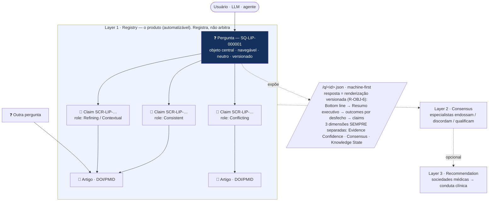
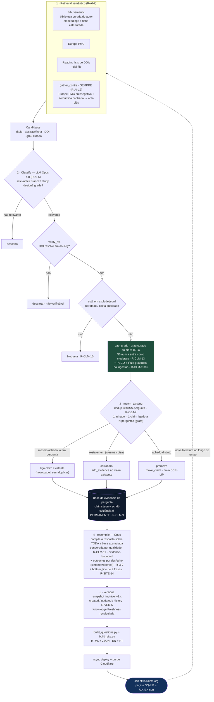
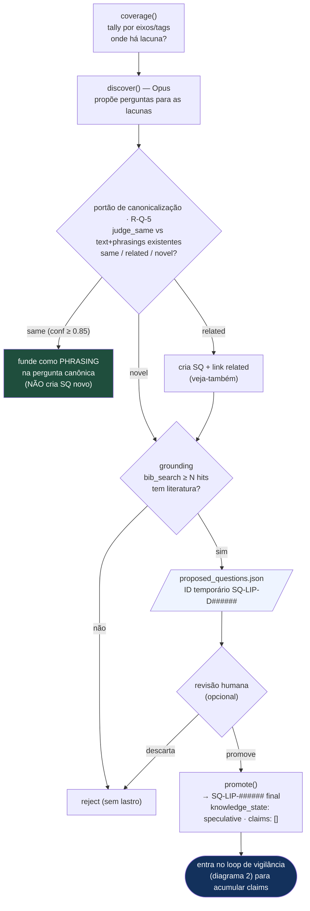
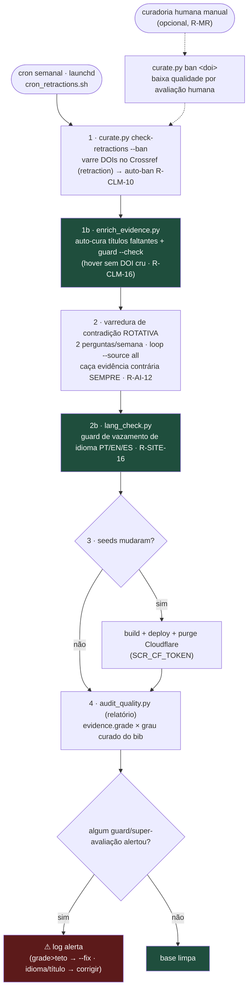
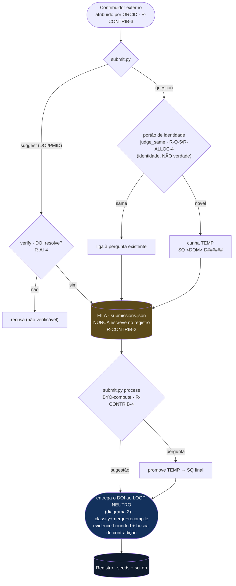

# Metodologia do SCR — fluxogramas

Visão de processo do **Scientific Claim Registry**. Fonte canônica das regras citadas (`R-…`):
[`RULES.md`](./RULES.md). Em caso de conflito, o RULES.md prevalece (R-DOC-1).

> *"PubMed stores scientific papers. ScientificClaims.org stores the evolving answers to scientific questions."*
> O SCR **registra, não arbitra.**

---

## 1 · Modelo de objeto e camadas

A **pergunta** é o objeto central navegável; **claims** são evidência versionada ligada a ela com um
*papel*; **artigos** são as fontes. Um artigo pode informar claims sob várias perguntas → é um **grafo**,
não uma árvore. Só a **Layer 1** precisa existir; Consensus e Recommendation são camadas opcionais acima.

---

## 2 · Loop de vigilância da Layer 1 (o coração da metodologia)

Ciclo automático e fechado: **retrieval → classify → verify/ban/ceiling → merge → recompile → version →
deploy**, que se realimenta quando nova literatura aparece.

---

## 3 · Estratégia de criação de perguntas (R-Q-4 · `propose_questions.py`)

A outra metade do loop: como novas **perguntas** nascem, com lastro na literatura, antes de virarem
oficiais. Ciclo de ID temp → final (R-ALLOC).

> **R-Q-5 — pergunta canônica + frases alternativas.** O `text` canônico é estável; `phrasings`/`phrasings_pt`
> são formas alternativas de fazer a MESMA pergunta. O portão acima impede duplicar perguntas semanticamente
> iguais (paráfrase → vira phrasing). As phrasings alimentam a **busca** do site, o **JSON/API** (roteamento
> machine-first de qualquer formulação → SQ canônico) e aparecem como *"Também perguntada como"* na página.

---

## 4 · Higiene e qualidade contínua (rede de segurança)

Controles que rodam **fora** do fluxo de ingestão para garantir que a base não degrade. Semanal via
`launchd` (`cron_retractions.sh`).

---

### Três camadas que garantem a qualidade do grade (R-CLM-13)

1. **Entrada** — teto na ingestão (`cap_grade`): o grau curado da biblioteca limita o grade do LLM.
   *Não entra errado.*
2. **Vigilância** — `audit_quality.py` no cron: detecta qualquer super-avaliação que escape.
   *Se entrar, é detectado.*
3. **Passado** — migração já aplicada (45 rebaixados + 161 preenchidos). *O que estava errado, corrigido.*

*Limite honesto:* a garantia de teto cobre artigos **na biblioteca curada**. Fontes só do Europe PMC não
têm grau curado — para esses sobra a heurística (tipo fraco + grade alto). Curar no `bib` antes de promover
a evidência forte fecha 100%.

**Guards automáticos no cron (rede de segurança da automação):** além do teto de grade (R-CLM-13), o ciclo
semanal roda três guards que **falham alto** se algo regredir — **título** em toda evidência (`enrich_evidence
--check`, R-CLM-16), **idioma** correto em todo campo PT/EN (`lang_check`, R-SITE-16), e a **busca de
contradição** rotativa (R-AI-12). São o que torna a compilação não supervisionada confiável (pré-requisito do
trilho server-side da Fase 2 — ver `decentralization.md`).

---

## 5 · Porta de contribuição (R-CONTRIB · `submit.py`)

Como um terceiro alimenta o registro **sem o fundador no caminho** e **sem risco às seeds**. Invariante de
segurança: o intake **nunca escreve no registro publicado** — só na fila; o conteúdo entra **apenas** pelo
compilador neutro (o loop do diagrama 2).

> **Por que é seguro abrir:** a superfície é estreita — um contribuidor só **sugere artigo** ou **propõe
> pergunta**, nunca escreve claim/resposta. Pior caso de abuso = *compute desperdiçado*, não corrupção (modelo
> *pull-request*). Na Fase 3 (server-side) some-se a isto uma **fila isolada + aprovação humana** antes do build
> (anti prompt-injection/spam) — ver `decentralization.md`.
